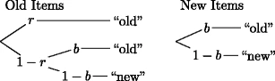
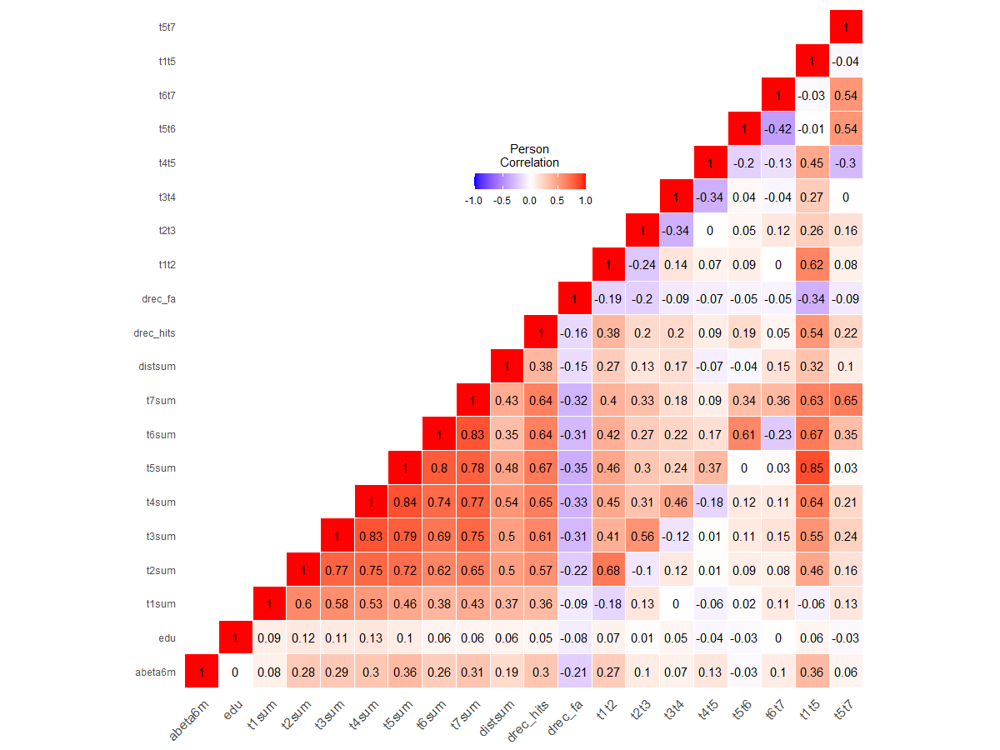

# Amyloid Positivity Exploration

## Motivation/Goal

This project was created over the span of a week long ML hackathon held virtually at UCI. Hackathon End Date: 04/25/2020

<p> Our main research question we focused our efforts on addressing was predicting which people tested Amyloid Positive based on other features in the dataset. For context, Amyloid Beta, the cerebrospinal fluid measurement taken at the time of assessment (or within 6 months of assessment) are believed to be one of the first indicators of otherwise pre-symptomatic Alzheimer's disease. Amyloid Positivity diagnosis is then determined according to the evidence-based cutoff of 192 pg/mL. Amyloid Beta levels below 192 pg/mL is considered Amyloid Positive, while above 192 pg/mL is considered Amyloid Negative. Some other topics of analysis we explored inlcluded predicting future test scores with past test scores, investigating the existance of different clusters or subgroups within the data, and thoroughly understanding the relationship between combinations of different features. </p>

### Libraries
```{r warning=FALSE, message=FALSE}
library(aod)
library(caret)
library(ggplot2)
library(InformationValue)
library(psychotree)
library(reshape2)
library(smbinning)
library(tidyverse)
```

### Raw Data

<p> Unprocessed data from 292 patients provided by the Alzheimer's Disease Neuroimaging Initiative. There are 939 assessments represented in terms of 19 variables from the AVLTAmyloidClassification dataset. </p>

##### Demographics:

* Age
* Sex
* Years of Education
   
##### Protocol Information:

* Time Since Baseline Test (Month 0)

##### Memory Test Outcomes:

* Free Recall Scores
* Recognition Scores

##### Biomarkers:

* APOE Genotype
* Beta Amyloid

##### Diagnosis of Memory Impairment:

* Cognitively Normal/Impaired


```{r warning=FALSE, message=FALSE}
amyloid <- read_csv('./Data/Amyloid.csv')
```

### Summary Statisitics

<p> Our data at a glance. Continuous features are summarized as means, while the categorical features are summarized as proportions. </p>
  
#### A. Demographics:

```{r echo = FALSE, warning=FALSE}
amyloid_demographic_baseline_summary <- amyloid %>%
  filter(month == 0) %>%
  summarise(
    mean_age  = mean(age), 
    mean_edu = mean(edu), 
    prop_male = sum(sex == 2)/n(),
    prop_female = sum(sex == 1)/n(),
  )
amyloid_demographic_baseline_summary
```

#### B. Protocol Information:

```{r echo = FALSE, warning = FALSE}
amyloid_test_performance_baseline_summary <- amyloid %>%
  filter(month == 0)  %>%
  group_by(abeta6mcut) %>% 
  summarise(
    mean_t1sum = mean(t1sum, na.rm = TRUE),
    mean_t2sum = mean(t2sum, na.rm = TRUE),
    mean_t3sum = mean(t3sum, na.rm = TRUE),
    mean_t4sum = mean(t4sum, na.rm = TRUE),
    mean_t5sum = mean(t5sum, na.rm = TRUE),
    mean_t6sum = mean(t6sum, na.rm = TRUE),
    mean_t7sum = mean(t7sum, na.rm = TRUE),
    drec_hits = mean(drec_hits, na.rm = TRUE),
    drec_fa = mean(drec_fa, na.rm = TRUE),
  )
amyloid_test_performance_baseline_summary
```

#### C. Memory Test Outcomes:

```{r echo = FALSE, warning = FALSE}
amyloid_avlt_baseline_summary <- amyloid %>%
  filter(month == 0)  %>%
  group_by(abeta6mcut) %>% 
  summarise(
    mean_t1sum = mean(t1sum, na.rm = TRUE),
    mean_t2sum = mean(t2sum, na.rm = TRUE),
    mean_t3sum = mean(t3sum, na.rm = TRUE),
    mean_t4sum = mean(t4sum, na.rm = TRUE),
    mean_t5sum = mean(t5sum, na.rm = TRUE),
    mean_t6sum = mean(t6sum, na.rm = TRUE),
    mean_t7sum = mean(t7sum, na.rm = TRUE),
  )
amyloid_avlt_baseline_summary
```


#### D. Biomarkers:

```{r echo = FALSE, warning = FALSE}
amyloid_biomarker_baseline_summary <- amyloid %>%
  filter(month == 0) %>%
  summarise(
    mean_abeta6_measure = mean(abeta6m, na.rm = TRUE),
    prop_negative = sum(abeta6mcut == 1)/n(),
    prop_positive = sum(abeta6mcut == 2)/n(),
    prop_e2e2 = sum(genotype == 1)/n(),
    prop_e2e3 = sum(genotype == 2)/n(),
    prop_e3e3 = sum(genotype == 3)/n(),
    prop_e2e4 = sum(genotype == 4)/n(),
    prop_e3e4 = sum(genotype == 5)/n(),
    prop_e4e4 = sum(genotype == 6)/n()
  )
amyloid_biomarker_baseline_summary
```


#### E. Diagnosis of Memory Impairment

```{r echo = FALSE, warning = FALSE}
amyloid_diagnosis_baseline_summary <- amyloid %>%
  filter(month == 0) %>%
  summarise(
    prop_normal_cognition = sum(dx == 1)/n(),
    prop_subjectively_impaired = sum(dx == 2)/n(),
    prop_objectively_impaired = sum(dx == 3)/n(),
  )
amyloid_diagnosis_baseline_summary
```


## Preprocessing

For preprocessing we:

1.  Factorized categorical features  
2.  Replaced all instances of NA (represented as negative quantities) with 0
3.  Added the recognition test proportion (drec_hits / drec_fa)
4.  Added the difference in test scores for select AVLT intervals
    + Learning Effect over immediate recall (t1t5)
    + Delayed Recall Effect (t5t6, t5t7)
    + Relative Improvement or Decline From Previous Test *i* (t*i*-t(*i*-1))

```{r warning = FALSE, message = FALSE}
amyloid <- amyloid %>%
  mutate(
    month = as.factor(if_else(month < 0, NA_real_, month)),
    abeta6m = if_else(abeta6m < 0, NA_real_, abeta6m),
    abeta6mcut = factor(abeta6mcut),
    sex = factor(sex),
    genotype = factor(genotype),
    dx = factor(dx),
    edu = if_else(edu < 0, NA_real_, edu),
    wordlist = factor(wordlist),
    t1sum = if_else(t1sum < 0, NA_real_, t1sum),
    t2sum = if_else(t2sum < 0, NA_real_, t2sum),
    t3sum = if_else(t3sum < 0, NA_real_, t3sum),
    t4sum = if_else(t4sum < 0, NA_real_, t4sum),
    t5sum = if_else(t5sum < 0, NA_real_, t5sum),
    t6sum = if_else(t6sum < 0, NA_real_, t6sum),
    t7sum = if_else(t7sum < 0, NA_real_, t7sum),
    distsum = if_else(distsum < 0, NA_real_, distsum),
    drec_hits = if_else(drec_hits < 0, NA_real_, drec_hits),
    drec_fa = if_else(drec_fa < 0, NA_real_, drec_fa),
    t1t2 = t2sum - t1sum,
    t2t3 = t3sum - t2sum,
    t3t4 = t4sum - t3sum,
    t4t5 = t5sum - t4sum,
    t5t6 = t6sum - t5sum,
    t6t7 = t7sum - t6sum,
    t1t5 = t5sum - t1sum,
    t5t7 = t7sum - t5sum,
    recognition_prop = drec_hits/drec_fa
  )

  baseline <- amyloid %>% filter(month == 0)
```


## Exploratory Data Analysis (EDA)

#### Exploring the association of Demographic/Biomarker/Diagnosis features with Performance Measures and Amyloid Beta Measures.

##### Key Observations:

*  Genotype was strongly associated with baseline AVLT scores and Beta Amyloid measures
*  There was a strong positive relationship between sex and baseline AVLT scores (females tend to score better), however, Amyloid Beta measures do not seem to vary by sex 
*  Education did not seem to be associated with either AVLT scores or Amyloid Beta levels
*  Neither test performance nor amyloid beta levels seemed to vary 

##### Inference:

*  Genotype is a discriminatory factor when predicting Beta Amyloid
*  Because sex is correlated with AVLT scores, but not Amyloid Beta levels, including sex into a linear model would introduce multicollinearity
        
#### A. Genotype
```{r echo = FALSE, warning = FALSE, fig.hold = 'hold', out.width="50%"}
par(mfrow = c(1,2))
baseline %>% gather("test_number", "score", c(t1sum, t2sum, t3sum, t4sum, t5sum, t6sum, t7sum)) %>%
  ggplot(aes(x = test_number, fill = genotype)) +
  scale_x_discrete(labels = c("IR 1", "IR 2", "IR 3", "IR 4", "IR 5", "DR 1", "DR 2")) +
  geom_boxplot(aes(x= test_number, y = score)) +
  scale_fill_discrete(name = "Genotype", labels = c("e2/e2", "e2/e3", "e3/e3", "e2/e4", "e3/e4", "e4/e4")) +
  labs(x = "AVLT", y = "Score") +
  ggtitle("AVLT Scores by Genotype")

amyloid %>% 
  ggplot(aes(x = month, fill = genotype)) +
  geom_boxplot(aes(x= month, y = abeta6m)) +
  scale_fill_discrete(name = "Genotype", labels = c("e2/e2", "e2/e3", "e3/e3", "e2/e4", "e3/e4", "e4/e4")) +
  labs(x = "Month", y = "Amyloid Beta Levels") + 
  ggtitle("Amyloid Beta Measures vs Time, by Genotype")
par(mfrow = c(1,1))
```

#### B. Sex
```{r echo = FALSE, warning = FALSE, fig.hold = 'hold', out.width="50%"}
par(mfrow = c(1,2))
baseline %>% gather("test_number", "score", c(t1sum, t2sum, t3sum, t4sum, t5sum, t6sum, t7sum)) %>%
  ggplot(aes(x = test_number, fill = sex)) +
  scale_x_discrete(labels = c("IR 1", "IR 2", "IR 3", "IR 4", "IR 5", "DR 1", "DR 2")) +
  geom_boxplot(aes(x= test_number, y = score)) +
  scale_fill_discrete(name = "Sex", labels = c("Female", "Male")) +
  labs(x = "AVLT", y = "Score") + 
  ggtitle("AVLT Scores by Sex")

amyloid %>%
  ggplot(aes(x = month, fill = sex)) +
  geom_boxplot(aes(x= month, y = abeta6m)) +
  scale_fill_discrete(name = "Sex", labels = c("Female", "Male")) +
  labs(x = "Month", y = "Amyloid Beta Levels") + 
  ggtitle("Amyloid Beta Measures vs Time, by Sex")
par(mfrow = c(1,1))
```

#### C. Education
```{r echo = FALSE, warning = FALSE, fig.hold = 'hold', out.width="50%"}
par(mfrow = c(1,2))
baseline %>% gather("test_number", "score", c(t1sum, t2sum, t3sum, t4sum, t5sum, t6sum, t7sum)) %>% 
  mutate(edu_factor = as.factor(ntile(edu, 3))) %>%
  ggplot(aes(x = test_number, fill = edu_factor)) +
  scale_x_discrete(labels = c("IR 1", "IR 2", "IR 3", "IR 4", "IR 5", "DR 1", "DR 2")) +
  geom_boxplot(aes(x= test_number, y = score)) +
  scale_fill_discrete(name = "Education Bracket", labels = c("<= Bachelors", "<= Masters", "<= PhD")) +
  labs(x = "AVLT", y = "Score") + 
  ggtitle("AVLT Scores by Education Group")

amyloid %>%
  mutate(edu_factor = as.factor(ntile(edu, 3))) %>%
  ggplot(aes(x = month, fill = edu_factor)) +
  geom_boxplot(aes(x = month, y = abeta6m)) +
  scale_fill_discrete(name = "Diagnosis", labels = c("<= Bachelors", "<= Masters", "<= PhD")) +
  labs(x = "Month", y = "Amyloid Beta Levels") +
  ggtitle("Amyloid Beta Measures vs Time, by Education")
par(mfrow = c(1,1))
```

#### D. Age
```{r echo = FALSE, warning = FALSE, fig.hold = 'hold', out.width="50%"}
par(mfrow = c(1, 2))
baseline %>% gather("test_number", "score", c(t1sum, t2sum, t3sum, t4sum, t5sum, t6sum, t7sum)) %>% 
  mutate(age_factor = as.factor(ntile(age, 3))) %>%
  ggplot(aes(x = test_number, fill = age_factor)) +
  scale_x_discrete(labels = c("IR 1", "IR 2", "IR 3", "IR 4", "IR 5", "DR 1", "DR 2")) +
  geom_boxplot(aes(x= test_number, y = score)) +
  scale_fill_discrete(name = "Age Range", labels = c("[54-72)", "[72-77)", "[77, 89]")) +
  labs(x = "AVLT", y = "Score") +
  ggtitle("AVLT Scores by Age Group")

amyloid %>%
  mutate(age_factor = as.factor(ntile(age, 3))) %>%
  ggplot(aes(x = month, fill = age_factor)) +
  geom_boxplot(aes(x= month, y = abeta6m)) +
  scale_fill_discrete(name = "Age", labels = c("[54-72)", "[72-77)", "[77, 89]")) +
  labs(x = "Month", y = "Amyloid Beta Levels") +
  ggtitle("Amyloid Beta Measures vs Time, by Age Group")
par(mfrow = c(1,1))
```

#### E. Diagnosis
```{r echo = FALSE, warning = FALSE, fig.hold = 'hold', out.width="50%"}
par(mfrow = c(1, 2))
baseline %>% gather("test_number", "score", c(t1sum, t2sum, t3sum, t4sum, t5sum, t6sum, t7sum)) %>%
  ggplot(aes(x = test_number, fill = dx)) +
  scale_x_discrete(labels = c("IR 1", "IR 2", "IR 3", "IR 4", "IR 5", "DR 1", "DR 2")) +
  geom_boxplot(aes(x= test_number, y = score)) +
  scale_fill_discrete(name = "Diagnosis", labels = c("Cognitively Normal", "Subjectively Cognitively Impaired", "Objective Mild Cognitive Impairment")) +
  labs(x = "AVLT", y = "Score") +
  ggtitle("AVLT Scores by Diagnosis")
  
amyloid %>%
  ggplot(aes(x = month, fill = dx)) +
  geom_boxplot(aes(x= month, y = abeta6m)) +
  scale_fill_discrete(name = "Diagnosis", labels = c("Cognitively Normal", "Subjectively Cognitively Impaired", "Objective Mild Cognitive Impairment")) +
  labs(x = "Month", y = "Amyloid Beta Levels") +
  ggtitle("Amyloid Beta Measures vs Time, by Diagnosis")
par(mfrow = c(1,1))
```

#### Exploring how various performance measures and their linear combinations are associated with Amyloid Positivity
##### Key Observations:

* Delta measure between scores on successive administrations of the immediate recall tasks did not vary much by Amyloid Positivity
* Overall change in performance across the immediate recall tasks (t5sum - t1sum) was noticeably different across Amyloid Positive and Negative Participants
* The ratio of hits to false alarms on the Recognition task seems to be greater for those who tested Amyloid Postive
   
##### Inference:

* The learning effect accross the immediate recall discriminates between Amyloid Postive and Negative participants far better than the individual test measures 

## Question 1: 

### Cluster Participants based on Recognition Task Performance using  

<p> Participants were given a **recognition task** of idetifying the old and new words from a list of 30 words written on a sheet of paper. This list was composed of all the words on the word list used as a part of the Immediate and Delayed Recall tasks in addition to 15 "new" words. The respondent has to identify all of the words from recall word list by circling 
them. The correctly recognized "old words" were counted as ```drec_hits```, while the number of "new" words incorrectly identified as "old" were recored as ```drec_fa```. From these two values, in addition to the total number of words on the "old" and "new" lists, we were able to compute the total number of false and true postitives for the "old" and "new" lists as follows:
</p>

* ``` old_old = drec_hits ``` : Number of "old" words correctly identified as "old"
* ``` old_new = 15 - drec_hits ``` : Number of "old" words incorrectly identified as "new"
* ``` new_new = 15 - drec_fa ``` : Number of "new" words correctly identified as "new"
* ``` new_old = drec_fa ``` : Number of "new" words incorrectly identified as "old"

<p> We modelled the cognitive process used by all the participants as a **One High Threshold** model as shown below:</p>

{#id .class width=35% height=35% align = 'center'}

<p> Using ** _ recursive partitioning _ ** on Multinomial Processing Trees we modelled the parameters **r** and **b** as functions of various covariates in our data.</p>

* $ r = P(recognizing a previously presented word) $
* $ b = P(randomly guessing that a word was previously presented) $

```{r warning = FALSE, message = FALSE}
# Baseline participants who have taken the Recognition Test
amyloid_mpt_data <- baseline %>% 
  filter(!is.na(drec_hits) | !is.na(drec_fa)) %>%
  select(sex, age, t1t5, t5t6, t5t7, dx, genotype, drec_fa, drec_hits, abeta6m)

# Creating count matrix of true positives, false positives, true negatives, and false negatives
# on the recognition-memory experiments
y <- as.matrix(
  cbind(
    old_old = amyloid_mpt_data$drec_hits, 
    old_new = 15-amyloid_mpt_data$drec_hits, 
    new_old = amyloid_mpt_data$drec_fa, 
    new_new = 15-amyloid_mpt_data$drec_fa
    )
  )
```

#### Immediate Recall Learning Effect (T5-T1)
```{r warning = FALSE, message = FALSE}
  # learning (T5 - T1 scores)
  amyloid_tree_learning <- mpttree(y ~ t1t5, data = amyloid_mpt_data, spec = mptspec("1HT"))
  plot(amyloid_tree_learning, index = c("r", "b"))
```

#### Age
```{r warning = FALSE, message = FALSE}
  # age
  amyloid_tree_age <- mpttree(y ~ age, data = amyloid_mpt_data, spec = mptspec("1HT"))
  plot(amyloid_tree_age, index = c("r", "b"))
```

#### Delayed Recall Interference Effect (T6 - T7)
```{r warning = FALSE, message = FALSE}
  # interference effect (T6 - T5)
  amyloid_tree_interference <- mpttree(y ~ t5t6, data = amyloid_mpt_data, spec = mptspec("1HT"))
  plot(amyloid_tree_interference, index = c("r", "b"))
```

#### Sex
```{r warning = FALSE, message = FALSE}
  # sex
  amyloid_tree_sex <- mpttree(y ~ sex, data = amyloid_mpt_data, spec = mptspec("1HT"))
  plot(amyloid_tree_sex, index = c("r", "b"))
```

#### Diagnosis
```{r warning = FALSE, message = FALSE}
  # dx
  amyloid_tree_learning <- mpttree(y ~ t1t5, data = amyloid_mpt_data, spec = mptspec("1HT"))
  plot(amyloid_tree_learning, index = c("r", "b"))
```

#### Genotype
```{r warning = FALSE, message = FALSE}
  # genotype
  amyloid_tree_genotype <- mpttree(y ~ genotype, data = amyloid_mpt_data, spec = mptspec("1HT"))
  plot(amyloid_tree_genotype, index = c("r", "b"))
```

#### Full Model
```{r warning = FALSE, message = FALSE}
  # full model
  amyloid_tree_all <- mpttree(y ~ sex + age + t1t5 + t5t6 + t5t7 + dx + genotype, data = amyloid_mpt_data, spec = mptspec("1HT"))
  plot(amyloid_tree_all, index = c("r", "b"))
```

#### Amyloid Beta Measure
```{r warning = FALSE, message = FALSE}
  # amyloid beta measure
  amyloid_tree_all <- mpttree(y ~ abeta6m, data = amyloid_mpt_data, spec = mptspec("1HT"))
  plot(amyloid_tree_all, index = c("r", "b"))
```
### Insights:
* **Immediate Recall Learning Effect** was grouped with cutoffs <=3, (3, 6], >6 where the probability of correctly recognizing a previously presented word is greater for those participants who exhibit larger learning effects in the immediate recall tasks
* **Age** was grouped with cutoffs <=67.1, (67.1, 69.9], >69.9 where the probability of correctly guessing that a word has been previously presented differs more than the probability of correctly recocnizing a word, across the groups
* **Interference Delayed Recall Effect** was categorized into two groups, where those whose scores dropped by more than 4 points had a lower probability of recognizing a previously presented word than those whose scores dropped by less than 4 points
* **Sex** showed similar patterns to those observed in the performance on the immediate and delayed recall tasks: females are more likely to recognize a previously presented word that males are
* **Diagnosis** was recategorized into two groups based on the probability of recognizing a previously presented word; those who are diagnosed as cognitively normal or subjectively impaired were much more likely to recognize a word than those who are diagnosed as objectively cognitively impaired
* **Genotype** was recategorized into two groups such that those with the e2/e2 and e2/e3 genes show have a higher probability of recognizing previously presented word than those who have the e3/e3, e2/e4, or e3/e4 gene, which aligns with the observations regarding amyloid beta levels as they relate to genotype
* **Full Model** learning effect and diagnosis were selected as the two features to categorize the participants; this selection was based on their probability of recognizing a previously presented word
* **Amyloid Beta Measure** was grouped into two categories with the cutoff set to 153pg/ml; those with amyloid measure below the cutoff had a lower chance of recognizing a previously presented word than those with measures greater than 153. This cutoff was relatively close to the true threshold for categorizing partic
   
#### Main Takeaway: Use the categories generated by the MPTs to create additional features that we could incorporate into our classification model for the task of predicting Amyloid Positivity. 

## Question 2: 

### Predict Amyloid Positivity with Feature Selection

#### Correlation Matrix

By generating a correlation matrix, we were able to highlight features that had a high corrolation with Amyloid Beta values. The features displayed in this correlation matrix are all of our continuous feature values. 

The features we concluded with the highest correlation rate with Amyloid Beta levels (abeta6m) were AVLT Learning Effect over the course of IFR1-IFR5 (t1t5), diagnosis (dx), and genotype.

{#id .class width=100%}

#### Logistic Regression Model

Using the information gleaned from the above matrix, we were able to select optimal feature combinations with which to train our logisic regression model with: t1t5, dx, and genotype.

We made two models to compare:

* Baseline: t1t5
* Full: t1t5 + dx + genotype

```{r warning = FALSE}
# Split data by Amyloid Positivity
logit_amyloid <- baseline %>% 
  mutate(abeta6mcut = as.factor(if_else(abeta6mcut == 1, 0, 1)))

abeta_neg <- logit_amyloid %>% filter(abeta6mcut == 0)
abeta_pos <- logit_amyloid %>% filter(abeta6mcut == 1)

# Create Test-Train Split
abeta_neg_training_rows <- sample(1:nrow(abeta_neg), 0.7*nrow(abeta_neg))  # neg for train pos
abeta_pos_training_rows <- sample(1:nrow(abeta_pos), 0.7*nrow(abeta_neg))  # pos for training. Pick as many pos as neg
training_pos <- abeta_pos[abeta_pos_training_rows, ]  
training_neg <- abeta_neg[abeta_neg_training_rows, ]
trainingData <- rbind(training_neg, training_pos)  # row bind the negitives and positives 

test_pos <- abeta_pos[-abeta_pos_training_rows, ]
test_neg <- abeta_neg[-abeta_neg_training_rows, ]
testData <- rbind(test_neg, test_pos)  # row bind the neg and pos

# Build logistic regression models

# Test
logit_baseline <- glm(abeta6mcut ~ t1t5, data=trainingData, family=binomial(link="logit"))
predicted_baseline <- plogis(predict(logit_baseline, testData))  # predicted scores
optCutOff_baseline <- optimalCutoff(testData$abeta6mcut, predicted_baseline)[1]

# Learning, Genotype, Diagnosis
logit_full <- glm(abeta6mcut ~ t1t5 + genotype + dx, data=trainingData, family=binomial(link="logit"))
predicted_full <- plogis(predict(logit_full, testData))  # predicted scores
optCutOff_full <- optimalCutoff(testData$abeta6mcut, predicted_full)[1]
```

#### Evaluation

Left Plot: Baseline Model

Right Plot: Full Model

```{r echo = FALSE, warning = FALSE, fig.hold = 'hold', out.width="50%"}
par(mfrow = c(1,2))
plotROC(testData$abeta6mcut, predicted_baseline)

plotROC(testData$abeta6mcut, predicted_full)
par(mfrow = c(1,1))
```


#### Model Diaognostics and Comparisons

As we can see from the outputs below, the model with t1t5, dx, and genotype combined performed better than the model with only t1t5 with an AUC score of 0.81 for t1t5 + dx + genotype vs 0.70 t1t5. The jump in AUC between just t1t5 and t1t5 + dx OR genotype resulted in a significant increase of ~.10. Adding the third feature in, only increased the AUC score by .01 but it was significant enough to include it in our model.

As an experiment, we tried different combinations of features not shown below and found that adding sex or education actually lowered the AUC score. 

##### A. Model Diagnostics

Baseline Model

```{r echo = FALSE, warning = FALSE}
summary(logit_baseline)
```

Full Model

```{r echo = FALSE, warning = FALSE}
summary(logit_full)
```

##### B. Misclassification Error (Lower the Better)

Baseline Model

```{r echo = FALSE, warning = FALSE}
misClassError(testData$abeta6mcut, predicted_baseline, threshold = optCutOff_baseline)
```

Full Model

```{r echo = FALSE, warning = FALSE}
misClassError(testData$abeta6mcut, predicted_full, threshold = optCutOff_full)
```
##### C. True Positive Rate

Baseline Model

```{r echo = FALSE, warning = FALSE}
InformationValue::sensitivity(testData$abeta6mcut, predicted_baseline, threshold = optCutOff_baseline)
```

Full Model

```{r echo = FALSE, warning = FALSE}
InformationValue::sensitivity(testData$abeta6mcut, predicted_full, threshold = optCutOff_full)
```

##### D. False Positive Rate

Baseline Model

```{r echo = FALSE, warning = FALSE}
InformationValue::specificity(testData$abeta6mcut,  predicted_baseline, threshold = optCutOff_baseline)
```

Full Model

```{r echo = FALSE, warning = FALSE}
InformationValue::specificity(testData$abeta6mcut,  predicted_full, threshold = optCutOff_full)
```

##### E. Confusion Matrix (Columns=Actual, Rows=Predicted)

Baseline Model

```{r echo = FALSE, warning = FALSE}
InformationValue::confusionMatrix(testData$abeta6mcut, predicted_baseline, threshold = optCutOff_baseline)
```

Full Model

```{r echo = FALSE, warning = FALSE}
InformationValue::confusionMatrix(testData$abeta6mcut, predicted_full, threshold = optCutOff_full)
```


## Question 3: 
### [Future Work] Predict test score trajectory in a single visit

For future work, we wanted to use a Linear Mixed-Effects Model (LME) to predict a patient's AVLT scores for future visits, based on their past visits. Unfortunately, due to time contraints, we did not complete our model before the hackathon deadline and were not able to evaluate our results in time.
  
##### Details:

* Target (what we want to predict): AVLT scores (t1sum, t2sum, ..., t1t5, ...)

* Fixed Effects (features that do not change over time): Demographics, Biomarkers, etc.

* Random Effects (variable features that change over time): Time from Baseline Visit (Month = 0), Interactions between month and AVLT score

##### Experiments

Something interesting we noticed after looking through our EDA was that females on average tend to get higher AVLT scores than males. We plan on taking this bias into account when training our model and comparing the results to a model that does not account for this bias.


